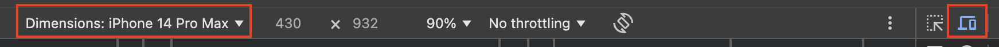

# Shangri-La Petitions Project

Welcome to the Shangri-La Petitions **FRONTEND** folder! This project was designed to provide a platform for people from Shangri-La to share, create their petitions.

## Website Setup Documentation

Follow these steps to set up the Shangri-La Petitions Project website:

## Prerequisites

Before you begin, ensure you have the following software and tools installed:

- **Visual Studio Code**: Latest version available [here](https://code.visualstudio.com/download).
- **Web Browser**: Any modern web browser will do. It is recommended to use Google Chrome for best experience.
- **Internet Connection**: A stable connection without restrictions is needed. Please do not use the University connection as it blocks the database.
- **Backend Connection**: To access the functionalities. Please follow the instructions inside the Backend [README](https://github.com/mkrandhawa/Shangri-La-Petition-Platform/blob/main/Backend/README.md) file. 


### Installation Steps

#### 1. Clone the Git Repository (Ignore if you already have the project files)

To clone the repository to your local machine, use the following command:

```bash
git clone https://github.com/mkrandhawa/Shangri-La-Petition-Platform
```

#### 2. Open the Project in Visual Studio Code

Navigate to the cloned repository or the extracted folder and open it with Visual Studio Code.


#### 3. Get Into the **frontend** folder

Within Visual Studio Code, open a terminal and execute:

```bash
cd frontend
```

#### 5. Install Dependencies

Within Visual Studio Code, in the same terminal execute:

```bash
npm install
```

Ignore any deprecated warnings.

#### 4. Start the Server

After installing start the server:

```bash
npm start
```
A similar screen should appear: 


#### 5. Access the Website
Once the process is complete, the system should automatically open the browser and take you to the right page.

However, if in case that does not work, open your web browser and go to:

```
localhost:3000
```

#### 8. Login with exsisting credentials

###### Login as User

```
Email: charlie@gmail.com
Password: test1234
```

###### Login as ADMIN

```
Email: admin@petition.parliament.sr
Password: 2025%shangrila
```

# Application Routes Documentation

This document outlines the routes available in the Shanri-La-Petitions Project and their functionalities.

## Public Routes

- `GET /`: Renders the landing/home page.
- `GET /login`: Renders the login form.
- `GET /signup`: Renders the signup form.

## User Routes

All the following routes are protected therefore you must be logged in as USER to have access to them.

- `GET /dashboard`: Renders the user's dashboard (protected route).
- `GET /slpp/petitions`: Renders the all petitions for the user (protected route).
- `GET /slpp/petitions?status=open`: Renders the open petitions page for the user (protected route).
- `GET /slpp/petition?status=closed`: Renders the closed petitions page for the user (protected route).
- `GET /addPetition`: Renders the form to add a new petition (protected route).
- `GET /myPetitions`: Renders the user's list of submitted petitions (protected route).


## Admin Routes

All the following routes are protected therefore you must be logged in as ADMIN to have access to them.

- `GET /adminDashboard`: Renders the admin's dashboard (protected route).
- `GET /slpp/petitions`: Renders the all the petitions created by the user (protected route).
- `GET /slpp/petitions?status=open`: Renders the open petitions created by the user (protected route).
- `GET /slpp/petition?status=closed`: Renders the closed petitions created by the user (protected route).
- `GET /reply`: Renders the form to reply to petitions that have reached the threshold (protected route).
- `GET /setThreshold`: Renders the form to set petition thresholds (protected route).

# Common Errors and Solutions

- **Database Connection Issues**: If you're experiencing connection issues on restricted networks like University Wi-Fi, try using mobile data or a VPN.
- **Access Denied**: If you're receiving permission errors, make sure you're using the correct routes for your user level; admin routes require admin access.

# Testing the responsiveness

Since the website is running on a localhost connection, certain functionalities—such as the QR scanner, and some of the CSS styles —may not work as expected on mobile devices.

To properly test the responsiveness, we recommend using Chrome's Developer Tools. To access it, press Command + Option + I or navigate to the three dots menu, then select More Tools → Developer Tools.

Once open, click the tablet and phone icon and select iPhone 14 Max from the list of predefined devices for the best experience.
 